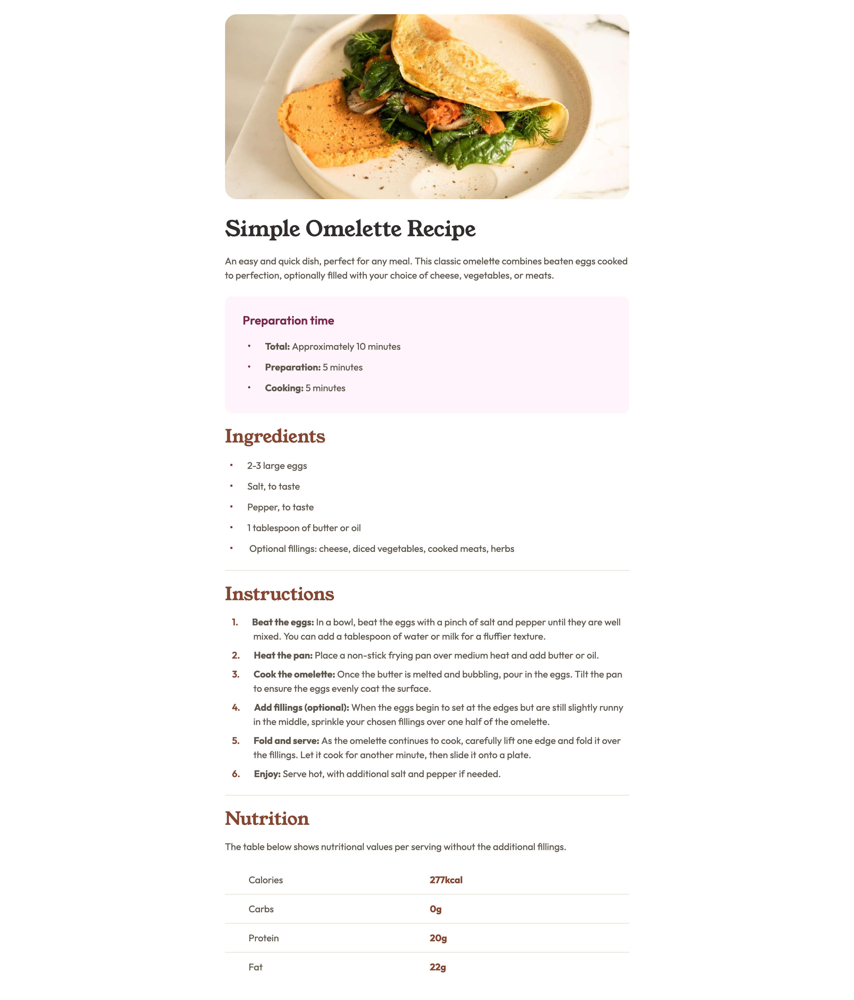

# Frontend Mentor - Recipe page solution

This is a solution to the [Recipe page challenge on Frontend Mentor](https://www.frontendmentor.io/challenges/recipe-page-KiTsR8QQKm). 

## Screenshot

## Links

- [Source](https://github.com/mothy-08/fm-recipe-page)
- [Live](mothy-08.github.io/fm-recipe-page/)

## Built with
- HTML & CSS
